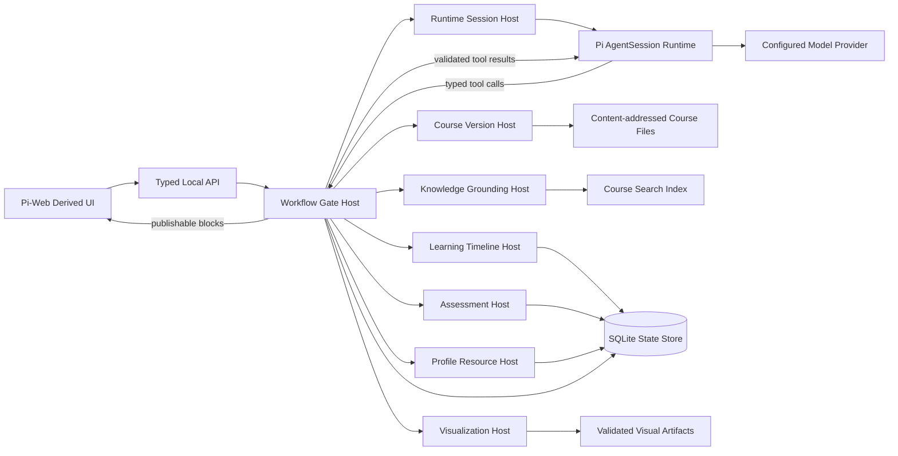
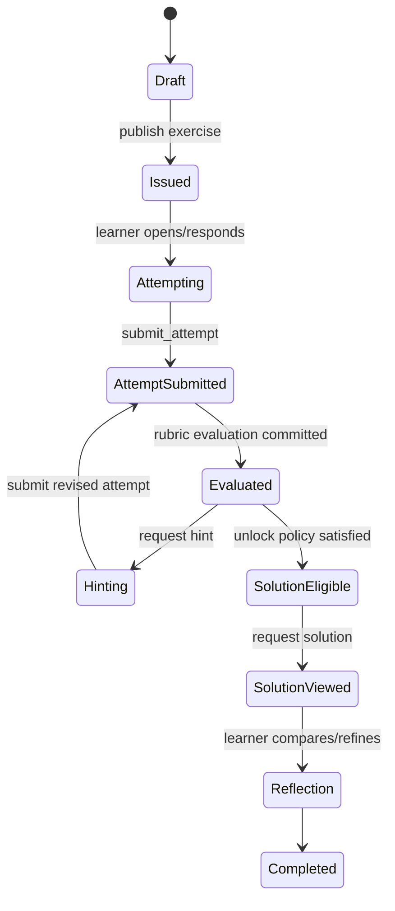

# Pi Learning Harness：详细架构与实施计划

> 文档版本：V0.1  
> 制定日期：2026-08-29  
> 暂定项目名：`pi-learning-harness`  
> 目标读者：项目负责人、架构评审者、负责实现的 CODEX / 开发者  
> 状态：架构规划稿，不是最终 API 承诺

**阅读路径**：0–5 节给出总架构与 Host 边界；6–15 节定义模式、课程、教学、答案门禁、可视化与前端；16–24 节给出数据、API、仓库、里程碑、测试和 CODEX 工作包；25–27 节冻结首版决定与端到端完成标准。

---

## 0. 结论先行

推荐路线不是在 Pi 外面再写一套独立 Agent Loop，也不是仅靠几段系统提示词模拟“学习模式”，而是：

1. **以前端仓库 `agegr/pi-web` 为浏览器端与会话交互底座**，保留其会话、流式事件、模型配置、插件/Skill 管理、Markdown/KaTeX/Mermaid、文件预览等成熟能力。
2. **继续使用 Pi 原生 `AgentSession` / `AgentSessionRuntime` 作为唯一 Agent Runtime**，不另造消息格式、重试循环、工具循环或会话存储。
3. 在 Pi 与前端之间增加一层独立的 **Learning Harness Host 控制面**：模式切换、课程绑定、资料检索、学习时间线、出题与答案门禁、可视化产物、验证和最终完成门，都由 Host 以类型化状态机强制执行。
4. 借鉴 `YN-translation-workshop` 已验证的经验：**Pi 负责推理，Host 负责权威状态、权限、事务、产物与完成判定**；不能把安全边界或“是否完成”交给模型自述。
5. 所有模式切换都解析成一个不可变的 **Resource Snapshot（资源快照）**。快照明确记录模型、思考等级、工具、插件、Skill、课程版本、知识范围、外部知识政策、答案门禁和可视化能力，并持久化到会话元数据中。
6. **课程切换不修改旧会话的知识边界**。默认行为是打开该课程最近会话或创建新会话；需要迁移旧对话时必须显式 fork，并重新绑定课程版本。
7. **学生学习模式与教师备课模式分包**。备课模块不只是 UI 隐藏，而应能从学生版构建中完整移除其路由、工具、Schema 注册、答案资产读取能力与前端代码。
8. 数学/计算机可视化采用 **结构化 `VisualizationSpec` → 固定渲染器 → 沙箱执行 → 验证 → HTML 舞台** 的流程。默认不执行模型自由生成的任意 HTML/JavaScript。
9. 产品首先做成**本地浏览器工作台**；未来可以增加薄桌面壳，但桌面壳只连接同一个本地服务与同一个 Pi 会话，不能复制第二套 Runtime 或 Transcript。
10. 首个可用版本应优先交付：模式预设、课程隔离、资料有据回答、时间线、答案门禁、基础数学/算法可视化；多用户、云同步、LMS 集成等推迟。

---

## 1. 需求解释与产品边界

### 1.1 核心目标

本项目要把通用 Pi Agent 改造成一个可切换用途、可长期学习、可核验知识来源、可进行互动练习、可生成高质量可视化的个人学习工作台。

核心能力分为四组：

- **配置预设**：一键切换模型、思考等级、工具、插件、Skill、知识范围与交互规则。
- **学习/教学系统**：课程选择、资料库、学习时间线、课程内问答、超范围解释、出题、提示、作答后解锁答案。
- **数学/计算机可视化**：固定、高质量、可重复的图形与过程动画，不依赖模型临时拼凑页面。
- **确定性 Harness**：足够多的 Host 边界、类型化工具、事务与验证，使结果不只依赖提示词和模型自觉。

### 1.2 对“备课模式可以直接拆除”的解释

本文将其解释为：

> 教师备课能力是一个可选产品包。构建学生版时，可以完全不包含教师 UI、教师 API、教师工具、答案库读取器、课程发布器和相关前端资源。

这比“在设置里隐藏一个按钮”更安全，也便于未来分别发布：

- `learning-harness-student`
- `learning-harness-teacher`
- `learning-harness-full`

### 1.3 明确不做的事情

第一阶段不做：

- 重新实现 Pi Agent Loop、Provider 层、工具调用协议或 JSONL 会话格式。
- 让课程资料中的文本直接成为系统指令。
- 仅通过 Prompt 要求模型“不许提前给答案”。
- 让模型直接写任意可执行 HTML/JS 并在主页面同源运行。
- 在一个既有会话中静默更换课程知识库。
- 一开始就做多用户学校平台、成绩认证、LMS、云端班级管理。
- 让多个 Host 都可以直接写同一权威状态。

---

## 2. 已核对的技术基线

### 2.1 Pi

核对基线：`earendil-works/pi`，2026-08-28 的主分支提交 `853a80d26c90a14c1886f0ebb8ffaae133ca2185`，最近发布版本为 `0.84.4`。

可直接依赖的能力：

- `@earendil-works/pi-agent-core`：Agent 状态、工具循环、消息状态。
- `@earendil-works/pi-coding-agent`：`AgentSession`、`AgentSessionRuntime`、JSONL 会话、资源加载、扩展、Skill、Compaction、Steer、Follow-up、Abort。
- `@earendil-works/pi-ai`：多 Provider 与模型目录。
- Extension API：生命周期事件、自定义工具、命令、UI、`tool_call` 阻断、`before_agent_start` 系统提示替换、资源发现、会话重载。
- Pi Package：插件、Skill、Prompt、Theme 的打包、过滤、启用与禁用。
- Pi Skill：按描述渐进加载，支持 `disable-model-invocation`。

重要限制：Pi 默认继承启动进程的文件、进程、网络与凭据权限；它本身不是完整权限沙箱。因此学习资料导入、代码运行和可视化执行必须另设边界。

参考：

- <https://github.com/earendil-works/pi>
- <https://github.com/earendil-works/pi/blob/main/packages/coding-agent/docs/sdk.md>
- <https://github.com/earendil-works/pi/blob/main/packages/coding-agent/docs/extensions.md>
- <https://github.com/earendil-works/pi/blob/main/packages/coding-agent/docs/skills.md>
- <https://github.com/earendil-works/pi/blob/main/packages/coding-agent/docs/packages.md>

### 2.2 Pi Web

核对基线：`agegr/pi-web` `v0.8.11`，提交 `28bab3c25f5f6770c9b0b745ebbfec1c27f7b948`。其 `package.json` 当前锁定 Pi `0.84.3`。

适合直接复用的能力：

- 本地浏览器 UI 与 Pi 的同一配置、会话文件。
- 会话浏览、恢复、分支、流式 SSE、掉线重连、运行态调和。
- 模型、Provider、插件、Skill 设置。
- Markdown、KaTeX、Mermaid、代码块和文件预览。
- Next.js 服务端直接创建进程内 `AgentSession`。
- 现有工具预设与“Chat only”资源边界。
- 路径允许列表、项目 Trust、插件包启停。

需要注意：Pi Web `v0.8.11` 锁定 Pi `0.84.3`，而 Pi 已发布 `0.84.4`。第一里程碑应先保持 Pi Web 的精确锁定版本，待基线测试冻结后，再单独做 `0.84.4` 升级兼容，不要在功能开发中混杂依赖升级。

参考：

- <https://github.com/agegr/pi-web>
- <https://github.com/agegr/pi-web/blob/main/AGENTS.md>
- <https://github.com/agegr/pi-web/blob/main/docs/adr/0002-chat-only-tool-selection.md>

### 2.3 YN Translation Workshop 可复用的设计经验

核对基线：`TohmaN233/YN-translation-workshop` `v2.0.8`，主分支提交 `419dc457a8a4bccd2c6ce0f0d5f29faa68668c8c`。

应继承的是架构经验，而不是把翻译业务代码直接搬来：

- 单一 Pi Runtime 与单一 Pi JSONL Transcript。
- Host 管理权威范围、任务、状态、产物、验证与完成门。
- Parent/Child 都使用 Pi 原生消息和独立可恢复会话。
- 前端只投影结构化状态，不承担完成判定。
- 持久状态带 revision，验证结果绑定 artifact revision。
- Dock、弹窗和远程页面连接同一 Runtime，而不是各有一套 Transcript。
- 类型化 IPC/API、机械验证、独立复审、确定性 Electron/E2E 验证。
- 明确区分“安全不变量”和“模型的规划偏好”。

参考：

- <https://github.com/TohmaN233/YN-translation-workshop/blob/main/docs/agent-runtime-codegraph.md>
- <https://github.com/TohmaN233/YN-translation-workshop/blob/main/docs/pi-web-migration-map.md>
- <https://github.com/TohmaN233/YN-translation-workshop/blob/main/docs/pi-native-host-constraint-audit.md>

---

## 3. 架构原则

### P1. Pi 是 Runtime，不是整个产品控制面

Pi 负责：

- 模型调用；
- 消息、工具与重试循环；
- 会话、Steer、Follow-up、Compaction；
- Agent 的语义判断。

Harness Host 负责：

- 当前模式与资源快照；
- 课程和资料版本；
- 检索允许范围；
- 时间线与掌握度；
- 练习状态与答案解锁；
- 可视化执行与产物；
- 最终回复是否可以发布。

### P2. 所有硬规则必须能由代码拒绝

例如：

- 当前会话不能读取另一个课程的 Span；
- 未提交有效尝试时不能读取 Solution Asset；
- 学生构建不能注册教师工具；
- 可视化代码不能访问网络或课程目录之外的路径；
- 模式应用失败不能留下半开半关的插件状态；
- Final Answer 必须携带当前课程版本的有效 Grounding Packet。

这些不能只写在系统提示中。

### P3. 模式是资源策略，不是 UI 标签

“学习模式”不是顶栏显示一个名字，而是一组完整、可持久化、可核验的资源与权限决议。

### P4. 课程是隔离边界

课程 ID、课程版本、资料 Hash、索引版本、学生/教师角色共同构成知识边界。检索请求必须显式带这些字段，不能依赖全局“当前目录”。

### P5. 会话是对话历史，时间线是学习历史

一个课程可以有多个 Pi 会话；一个学习时间线跨越这些会话。不能把所有学习进度都塞进 Prompt 或依赖会话摘要保存。

### P6. 引用、推导、计算和外部知识要区分

资料中直接出现、跨资料综合、从课程前提推导、通过程序计算、外部补充、证据不足，必须是不同状态。

### P7. 可视化以结构化 Spec 为权威

模型生成意图和参数，Host 生成或运行受限代码，固定渲染器负责页面。HTML 是产物，不是权威输入。

### P8. 单一写入者

每一种权威状态只允许一个 Host 写入。其他模块通过命令请求变更，不能直接修改数据库表或 JSONL。

### P9. 模块化单体优先，不做微服务堆砌

“足够多 Host”指清晰、可测试、单一职责的代码边界，不表示一开始启动九个网络服务。首版应在一个本地 Next.js/Node 进程中实现模块化单体。

### P10. 评测与运行分离

Pi Agent 不能同时充当自己的最终裁判。评测 Harness 应读取冻结输入、事件、工具调用、数据库差异、产物与 Validator 结果进行外部判定。

---

## 4. 总体架构



### 4.1 一次普通问答的完整路径

```text
用户消息
  -> 前端附加 sessionId / courseVersionId / profileSnapshotId
  -> Workflow Gate 冻结本轮上下文
  -> Knowledge Host 检索当前课程
  -> 生成 Grounding Packet
  -> Pi Tutor Agent 推理并调用受限工具
  -> Draft Answer
  -> Grounding / Scope / Exercise Leakage / Output Schema 验证
  -> 验证通过：提交 Timeline Event 并发布
  -> 验证失败：同一 Pi run 接收结构化修复要求
  -> 修复耗尽：Host 发布明确的“证据不足/无法按当前政策回答”结果
```

### 4.2 为什么不能让前端直接切 Skill/插件后马上发消息

模式切换可能同时改变：

- 已加载 Extension 代码；
- 可见 Skill 描述；
- 模型、Thinking；
- 工具列表；
- 系统提示；
- 课程索引；
- 答案访问能力；
- 教师权限。

这些变化不一定都能在活动 `AgentSession` 中安全热更新。因此需要 Host 先解析差异，再决定热切换、重建 Wrapper 或创建新会话。

---

## 5. Host 拓扑与权威边界

这些 Host 首版可以是同一进程中的 TypeScript 模块，但必须有独立接口、Schema、测试和单一写入权。

| Host | 权威职责 | 允许写入 | 禁止事项 |
|---|---|---|---|
| `RuntimeSessionHost` | 创建、恢复、重建、停止 Pi Session；SSE 事件桥；JSONL 绑定 | Pi 会话及 Harness 会话绑定元数据 | 不决定课程答案是否正确 |
| `ProfileResourceHost` | 解析模式预设；计算资源差异；生成 Resource Snapshot；事务切换 | Profile、Snapshot、Session Profile Binding | 不直接修改课程内容 |
| `CourseVersionHost` | 课程创建、导入、版本冻结、课程切换、资料身份 | Course、CourseVersion、Material Manifest | 不生成最终回答 |
| `KnowledgeGroundingHost` | 当前课程检索、Span 读取、证据包、范围分类 | 索引与 Grounding 记录 | 不跨课程检索；不写学习掌握度 |
| `LearningTimelineHost` | Append-only 学习事件、进度、概念掌握度、复习队列 | Timeline Event、Mastery Projection | 不解锁答案 |
| `AssessmentHost` | 练习、尝试、提示阶梯、Solution Capability、评分证据 | Exercise、Attempt、Unlock、Rubric Result | 未满足策略时不能返回答案资产 |
| `VisualizationHost` | Visual Spec、受限计算、渲染、验证、产物发布 | Visual Run、Artifact、Validation | 不执行任意同源 JS；不直接写课程源文件 |
| `WorkflowGateHost` | 固定工作流状态机、幂等命令、完成门、最终回复发布 | Workflow Run、Validator Result、Publication Event | 不绕过其他 Host 直接改权威表 |
| `TeacherAuthoringHost`（可选包） | 教案、题库、答案、Rubric、课程发布、学生预览 | Teacher Draft、Solution Asset、Published Course | 学生构建中不得注册或加载 |

### 5.1 Host 数量与确定性的关系

增加 Host 只有在以下条件同时成立时才提高确定性：

- 每个 Host 有唯一权威职责；
- 输入输出有严格 Schema；
- 写入有事务、revision 和 idempotency key；
- Host 间不能共享可变全局对象；
- Workflow Gate 负责顺序和完成门；
- 故障时能知道是哪一条边界拒绝，而不是全部返回模糊错误。

因此不建议再增加“规划 Host”“回答 Host”“解释 Host”等仅包装 Prompt 的伪 Host。

---

## 6. 模式预设与资源自动开关

### 6.1 Profile 是什么

Profile 描述一个模式的完整期望状态。建议使用 YAML 作为人工编辑格式，并在加载后转换为版本化 JSON Schema 对象。

示例：

```yaml
schemaVersion: 1
id: student-learn
label: 学习模式
role: student

model:
  provider: null          # null 表示沿用用户选择
  modelId: null
  thinkingLevel: high

runtime:
  builtInTools:
    mode: exact
    values: []               # 学生课程模式不用通用文件系统工具
  customTools:
    required:
      - course_context
      - search_course_knowledge
      - read_course_span
      - record_learning_event
      - create_visual_spec
    optional:
      - run_code_trace
  network: deny-by-default

resources:
  packages:
    allow:
      - local:packages/pi-learning-core
      - local:packages/pi-visual-lab
    deny:
      - local:packages/pi-teacher-studio
  skills:
    allow:
      - grounded-tutoring
      - mathematical-explanation
      - algorithm-visualization
    hiddenUnlessExplicit:
      - advanced-proof-search

coursePolicy:
  requireActiveCourse: true
  courseSwitch: open-or-create-bound-session
  externalKnowledge: explain-and-label
  citationsRequired: true

assessmentPolicy:
  solutionUnlock: after-first-meaningful-attempt
  hintsBeforeAttempt: true
  maxHintLevelBeforeAttempt: 2

visualPolicy:
  enabled: true
  arbitraryHtml: false
  renderers:
    - function-plot
    - geometry
    - matrix-transform
    - algorithm-trace
    - graph-trace
```

### 6.2 配置层级

解析顺序：

```text
产品安全底线
  < 用户全局默认 Profile
  < 课程 Profile Override
  < 当前会话临时 Override
  < 当前回合一次性 Capability
```

规则：

- 后层可以收窄权限。
- 后层不能突破产品安全底线。
- 学生会话不能通过 Override 添加教师能力。
- 一次性 Capability 必须有作用域、过期时间、用途和消费次数。
- 所有层合并后生成不可变 Snapshot，Agent 不直接读取未解析的多层配置。

### 6.3 Resource Snapshot

建议结构：

```json
{
  "schemaVersion": 1,
  "snapshotId": "rs_...",
  "profileId": "student-learn",
  "profileRevision": 7,
  "courseId": "course_linear_algebra",
  "courseVersionId": "cv_...",
  "courseManifestSha256": "...",
  "role": "student",
  "model": {
    "provider": "openai",
    "modelId": "...",
    "thinkingLevel": "high"
  },
  "activeBuiltInTools": ["read", "grep", "find", "ls"],
  "activeCustomTools": ["course_context", "search_course_knowledge"],
  "packageResources": [
    {"source": "local:packages/pi-learning-core", "extensions": ["..."], "skills": ["..."]}
  ],
  "knowledgePolicyHash": "...",
  "assessmentPolicyHash": "...",
  "visualPolicyHash": "...",
  "createdAt": "2026-08-29T00:00:00Z"
}
```

Snapshot 应同时：

- 写入 Harness 数据库；
- 在 Pi JSONL 中追加 `learning-harness:resource-snapshot` 自定义条目；
- 在每次工具调用上下文中携带 `snapshotId`；
- 在恢复会话时校验数据库与 JSONL 的绑定是否一致。

### 6.4 三类切换

#### Hot Switch

无需重新加载 Extension 的状态：

- 模型；
- Thinking Level；
- UI 布局；
- 某些非空工具集合的收窄；
- 显示偏好。

Host 仍要记录新 Snapshot。

#### Warm Switch

必须重建同一会话的 Pi Wrapper：

- 插件/Extension 加载或卸载；
- Skill 发现路径改变；
- Chat-only 与普通 Agent 边界跨越；
- 基础 System Prompt 构造方式改变；
- 资源加载器改变。

重建前写入预备记录，重建成功后才提交绑定；失败则恢复旧 Snapshot。

#### Hard Switch

必须打开/创建另一个课程绑定会话，或显式 fork：

- 切换课程；
- 学生角色与教师角色互换；
- Solution Capability 范围变化；
- 课程版本变化且旧版本仍有活动练习；
- 安全沙箱等级变化。

### 6.5 原子切换状态机

```text
requested
  -> resolve-profile
  -> validate-resources
  -> compute-diff
  -> prepare-new-runtime-or-session
  -> verify-effective-state
  -> append-snapshot-entry
  -> commit-binding
  -> publish-ui-state
```

任一步失败：

```text
failure
  -> dispose-prepared-runtime
  -> retain-old-binding
  -> record-failure-with-diagnostics
  -> show-actionable-error
```

不得出现：插件已经关闭，但 UI 和会话仍显示旧 Profile 已激活。

### 6.6 插件与 Skill 的具体控制策略

- **安装库存与模式激活分离**：插件管理页面负责安装、卸载和用户级信任；Profile 切换只应用会话级 Resource Loader Overlay，不应反复改写全局 `~/.pi/agent/settings.json`。只有用户显式执行“安装/卸载/修改全局默认”时才持久修改 Pi 设置。
- **插件包**：使用 Pi Package filter 的精确资源列表，不建议为了切模式而反复安装/卸载 NPM 包。
- **Extension**：加载与否属于 Runtime 创建时策略；改变时按 Warm Switch 重建。
- **Skill**：
  - Profile 允许的 Skill 才进入 Resource Loader；
  - `disable-model-invocation` 只控制自动暴露，不等同于安全禁止；
  - 真正禁止的 Skill 不应进入当前 Snapshot 的发现路径。
- **工具**：Host 根据 Profile 生成严格 allowlist；自定义工具也必须受 allowlist，不只控制 Pi 内置工具。
- **缺失资源**：`required` 缺失时切换失败；`optional` 缺失时生成明确诊断但可继续。
- **未知资源**：Profile 中出现未识别工具、包或 Skill 时默认 fail closed。

---

## 7. 课程、资料库与版本隔离

### 7.1 课程不是一个普通文件夹

课程对象至少包含：

- 课程身份与名称；
- 当前已发布版本；
- 原始资料 Manifest；
- 规范化资料；
- Source Span 索引；
- Knowledge Point 与 Concept Graph；
- Lesson/Timeline 模板；
- 练习与 Rubric；
- 可选教师资产；
- 课程级 Profile Override；
- 外部知识政策。

### 7.2 推荐课程目录

```text
courses/<course-id>/
├─ course.yaml
├─ source/
│  ├─ raw/                       # 用户原始资料，只读
│  └─ manifest.json              # 路径、媒体类型、SHA-256、导入时间
├─ normalized/
│  ├─ documents/                 # 规范化 Markdown / text / code units
│  ├─ spans/                     # 稳定 Source Span
│  └─ assets/                    # 图片、表格、公式等派生产物
├─ lessons/
│  ├─ timeline.yaml
│  └─ lesson-*.yaml
├─ exercises/
│  ├─ public/                    # 学生可见题面与提示元数据
│  └─ rubrics-public/            # 可公开评分标准
├─ visuals/
│  └─ templates/
└─ teacher/                      # 仅教师包读取
   ├─ solutions/
   ├─ private-rubrics/
   └─ authoring-drafts/
```

运行状态不要直接写进这个源目录，而放入统一 Harness State Store，以便课程包可复制、签名、发布和重建索引。

### 7.3 导入流程

```text
选择资料
  -> 路径/类型/大小/安全预检
  -> 复制或绑定为只读 source asset
  -> 计算 SHA-256
  -> 类型适配器解析
  -> 规范化章节、段落、公式、代码单元、表格
  -> 生成稳定 Source Span ID
  -> 建立关键词与结构索引
  -> 可选生成 embedding 索引
  -> 提取候选 Knowledge Point
  -> Host 机械核对每个 Knowledge Point 的 Span 绑定
  -> 发布新的 CourseVersion
```

#### 首版导入格式优先级

P0：

- Markdown；
- TXT；
- PDF；
- HTML；
- 源代码文件；
- Jupyter Notebook 的 Markdown/Code 单元。

P1：

- DOCX；
- EPUB；
- LaTeX 工程；
- 幻灯片。

所有导入器实现统一接口，避免把 PDF 特殊逻辑写死在 Course Host。

### 7.4 Source Span

每个 Span 必须有稳定身份：

```json
{
  "spanId": "sp_...",
  "courseVersionId": "cv_...",
  "materialId": "mat_...",
  "documentPath": "normalized/documents/ch03.md",
  "headingPath": ["第三章", "3.2 特征值"],
  "startOffset": 1024,
  "endOffset": 1458,
  "textSha256": "...",
  "kind": "paragraph",
  "page": 17,
  "sourceLocator": {
    "rawPath": "source/raw/linear-algebra.pdf",
    "rawPage": 17
  }
}
```

回答引用、Knowledge Point、练习出处和时间线都引用 Span ID，而不是复制一段容易失效的自由文本。

### 7.5 检索策略

首版采用可替换接口下的混合检索：

1. 当前课程版本硬过滤；
2. Lesson/章节/概念范围过滤；
3. SQLite FTS5 或等价关键词检索；
4. 可选本地向量检索；
5. 结构邻接扩展：同章节、公式定义、代码上下文；
6. 去重与证据覆盖选择；
7. 返回固定预算内的 Source Span。

不要在一开始绑定不可替换的外部向量数据库。元数据与 Timeline 使用 SQLite；向量层通过 `KnowledgeIndexAdapter` 抽象。

### 7.6 课程切换语义

默认 UI 操作：

- 选择课程 A：打开 A 的最近可恢复会话；没有则新建。
- 选择课程 B：打开 B 的最近可恢复会话；没有则新建。
- 当前课程 A 的 Transcript、Snapshot 和 Timeline 绑定保持不变。
- “带着当前对话去课程 B”必须是显式 fork，并显示：旧对话可能含 A 的知识，需要生成迁移摘要且不能成为 B 的课程证据。

这样可避免课程 B 检索正确，但模型上下文里仍残留课程 A 结论的隐性污染。

### 7.7 资料中的 Prompt Injection

资料文本一律视为数据：

- 解析器不执行脚本、宏、嵌入对象；
- 在 Prompt 中用明确的“引用资料块”边界包裹；
- 资料中的“忽略系统指令”“调用工具”等文字不能提升为指令；
- Knowledge Host 返回的每段文本都标注来源与 `untrusted_course_content: true`；
- Tool Call Gate 拒绝由资料文本诱导的越权调用；
- 导入报告应标记疑似指令注入文本，供教师检查。

---

## 8. 学习模式中的有据回答策略

### 8.1 回答范围分类

每个最终回答都必须属于以下一种或多种状态：

| 状态 | 含义 | 用户界面 |
|---|---|---|
| `grounded_direct` | 结论在资料 Span 中直接出现 | “课程资料直接支持” |
| `grounded_synthesis` | 结论由多个资料 Span 综合而成 | “课程资料综合” |
| `derived` | 前提来自课程，结论由明确推导得到 | “基于课程内容推导”并展示关键推导 |
| `computed` | 通过受限代码、符号计算或实验得到 | “计算/实验结果”并附参数、代码或 Trace |
| `external` | 使用课程外知识，且课程政策允许 | “课程外补充”并解释为何需要 |
| `insufficient` | 课程资料不足且外部补充被禁止或仍不能回答 | 明确指出缺少什么 |

一个答案可以前半段是 `grounded_direct`，后半段是 `external`；UI 应在段落或 Claim 级别标注，而不是只在整条回答顶部放一个模糊标签。

### 8.2 Grounding Packet

Agent 作答前由 Knowledge Host 生成：

```json
{
  "groundingPacketId": "gp_...",
  "courseVersionId": "cv_...",
  "query": "为什么协方差矩阵半正定？",
  "retrievedSpans": [
    {
      "spanId": "sp_definition_covariance",
      "score": 0.91,
      "role": "definition"
    },
    {
      "spanId": "sp_quadratic_form",
      "score": 0.87,
      "role": "proof-premise"
    }
  ],
  "allowedAnswerModes": ["grounded_direct", "grounded_synthesis", "derived"],
  "externalPolicy": "explain-and-label",
  "exerciseContext": null,
  "createdForRunId": "run_..."
}
```

Packet 是本轮冻结对象。课程在回答过程中发布新版本，不应让本轮证据无声变化。

### 8.3 回答工作流

```text
1. 判断用户问题是否属于当前课程与当前 Lesson。
2. 检索并生成 Grounding Packet。
3. Agent 仅看到允许的资料 Span 与元数据。
4. Agent 返回结构化 Draft：Claims + Explanation + Citations + Scope Labels。
5. Grounding Validator 检查：
   - Span 是否存在；
   - 是否属于当前 CourseVersion；
   - 引用文字 Hash 是否匹配；
   - Claim 是否错误标为 direct；
   - external 段是否说明原因；
   - insufficient 时是否给出可执行学习指导。
6. 对 derived/computed 运行对应验证器。
7. 发布为结构化消息块并提交时间线事件。
```

### 8.4 超出资料范围时的行为

课程可以配置三种政策：

#### `deny`

只使用课程资料。超范围时：

- 明确说资料没有覆盖；
- 指出缺少的定义、定理、API 或先修知识；
- 给出应补充什么材料；
- 不私自用模型常识填补。

#### `explain-and-label`（推荐默认）

允许补充，但必须：

- 先回答课程资料能支持的部分；
- 标出从哪一步开始超出资料；
- 解释为什么需要外部知识；
- 把外部内容和课程结论分开；
- 不把外部内容写入课程 Knowledge Point，除非教师随后导入并发布新版本。

#### `open`

可以正常调用外部检索和知识，但仍保留来源标签。适合研究模式，不适合作为严格课程考核模式。

### 8.5 推导与计算的特殊处理

数学问题常出现“资料没写结论，但可由资料中的定义推出”。不能将其错误标成外部知识。

`derived` 必须附：

- 使用的课程前提 Span；
- 关键推理步骤；
- 是否使用课程未介绍的定理；
- 推导置信度或验证状态。

`computed` 必须附：

- 运行器类型与版本；
- 输入参数；
- 随机种子；
- 代码或可检查的 Trace；
- 运行结果 Hash；
- 是否只是数值证据而非证明。

### 8.6 最终输出门

最终用户可见文本不能由 Agent 直接写入 HTTP Response。应经过：

- Schema Validator；
- Course Scope Validator；
- Citation Validator；
- Exercise Leakage Validator；
- Unsafe HTML/Link Sanitizer；
- Timeline Commit；
- Publication Gate。

验证失败时，Host 将具体失败项作为结构化修复消息返回同一 Agent Run；修复次数有上限。耗尽后发布安全降级答案，而不是无限循环。

---

## 9. 学习 Timeline、概念图与掌握度

### 9.1 Timeline 是 Append-only Event Log

建议事件：

```text
course_opened
course_version_changed
material_added
lesson_started
lesson_completed
question_asked
grounding_packet_created
answer_published
concept_encountered
exercise_issued
attempt_submitted
attempt_evaluated
hint_used
solution_unlocked
solution_viewed
visual_created
visual_interacted
mastery_updated
review_scheduled
review_completed
teacher_note_added
```

事件示例：

```json
{
  "eventId": "le_...",
  "eventType": "attempt_submitted",
  "courseId": "course_linear_algebra",
  "courseVersionId": "cv_...",
  "sessionId": "pi_session_...",
  "runId": "run_...",
  "actor": "student",
  "subject": {
    "exerciseId": "ex_eigen_003",
    "attemptId": "att_..."
  },
  "payload": {
    "contentSha256": "...",
    "format": "markdown"
  },
  "createdAt": "2026-08-29T00:00:00Z"
}
```

撤销不删除旧事件，而追加补偿事件，例如 `teacher_note_retracted`、`mastery_override_reverted`。

### 9.2 Materialized Projection

为前端效率，从事件流生成：

- 当前 Lesson 进度；
- 概念最后接触时间；
- 练习成功/失败次数；
- 提示依赖程度；
- 掌握度与证据；
- 待复习队列；
- 最近可恢复上下文。

Projection 可重建，Event Log 才是权威。

### 9.3 概念图

每个 Knowledge Point 绑定：

- `conceptId`；
- 定义 Span；
- 前置概念；
- 相关例子；
- 相关练习；
- 掌握证据。

边类型建议：

- `requires`
- `defines`
- `uses`
- `generalizes`
- `contrasts`
- `example-of`
- `assessed-by`

### 9.4 掌握度不是模型一句“你已经会了”

Mastery 更新必须引用证据：

```json
{
  "conceptId": "concept_covariance_psd",
  "status": "learning",
  "confidence": 0.63,
  "evidence": [
    {"type": "attempt", "attemptId": "att_...", "rubricScore": 0.75},
    {"type": "explanation", "eventId": "le_...", "reviewed": false}
  ],
  "nextReviewAt": "..."
}
```

首版可采用简单、透明的规则，不需要一开始引入复杂知识追踪模型：

- 未接触；
- 已接触；
- 练习中；
- 初步掌握；
- 稳定掌握；
- 需要复习。

### 9.5 Timeline UI

左侧课程树下显示：

```text
课程
├─ 当前进度
├─ Timeline
│  ├─ 今天
│  ├─ 本周
│  └─ 按 Lesson
├─ 概念图
├─ 练习记录
├─ 可视化记录
└─ 待复习
```

点击任意事件可打开：

- 当时会话位置；
- 使用的课程版本；
- Grounding Packet；
- 练习尝试；
- 可视化 Artifact；
- Validator 结果。

---

## 10. 出题、尝试与答案门禁

### 10.1 核心原则

“答案只在看到用户尝试后给出”必须由 Assessment Host 控制资料可见性和最终输出，不能只靠 Prompt。

### 10.2 练习状态机



### 10.3 公开题面与私有答案分离

练习对象拆成：

- `ExercisePublic`：题目、目标、允许输入格式、公开提示元数据。
- `RubricPublic`：学生可见标准。
- `RubricPrivate`：完整评分要点与错误类型。
- `SolutionAsset`：标准答案、等价答案、代码测试、证明结构。
- `ForbiddenAnswerSignature`：未解锁前用于检测泄漏。

Tutor Agent 在答案解锁前不能拿到 `SolutionAsset` 和私有 Rubric。

### 10.4 “有意义的尝试”默认定义

默认解锁策略：`after-first-meaningful-attempt`。

机械最低条件：

- 非空；
- 不是仅包含“不会”“给答案”“?”等回避文本；
- 满足题目所需输入类型，例如代码题有代码块、证明题至少有一个命题或推理步骤；
- 与 Exercise ID 和当前 Attempt Token 绑定；
- 通过大小、编码和安全检查。

语义上是否真的尝试，由只读 Attempt Evaluator 给出 `meaningful / non-meaningful / malformed`，但 Host 应保留机械底线，避免模型随意放行。

课程可配置：

- 第一次有意义尝试后解锁；
- N 次尝试后解锁；
- 达到某提示等级后解锁；
- 教师手动批准；
- 永不显示完整答案，只给反馈。

### 10.5 Solution Capability

解锁后由 Assessment Host 发放短期能力：

```json
{
  "capabilityId": "cap_...",
  "kind": "read-solution",
  "exerciseId": "ex_...",
  "attemptId": "att_...",
  "courseVersionId": "cv_...",
  "sessionId": "pi_session_...",
  "maxUses": 1,
  "expiresAt": "..."
}
```

`read_exercise_solution` 工具必须同时校验全部绑定字段。Capability 消费后写入事件。

### 10.6 提示阶梯

在第一次尝试前，可以给不泄露最终答案的有限提示：

- Level 0：澄清题意；
- Level 1：提醒相关课程概念；
- Level 2：指出下一步操作或检查点；
- Level 3：给局部结构，但不填最终结果；
- Level 4：仅在策略允许时接近完整解法。

每次提示写入 Timeline，并影响后续 Mastery 证据。

### 10.7 答案泄漏防护

任意开放式自然语言系统都很难对“语义上没有泄漏答案”给出绝对数学保证，但可以建立强边界：

1. 未解锁前不把 Solution Asset 放进 Tutor 上下文。
2. 课程检索器过滤 `teacher/solutions` 和答案 Span。
3. 所有答案工具需要 Capability。
4. 最终输出运行 `ExerciseLeakageValidator`。
5. 教师发布题目时生成 Forbidden Signature：
   - 标准化精确答案；
   - 数值等价形式；
   - 公式 AST；
   - 关键证明结论；
   - 代码测试所揭示的目标输出；
   - 关键短语集合。
6. 检测到泄漏时拒绝发布并要求 Agent 改为提示。
7. 对开放证明题增加只读 Reviewer，但 Reviewer 不能把 Solution 返回 Tutor，只能给 `leak / safe / uncertain`。
8. `uncertain` 默认按泄漏处理，除非教师政策允许。

### 10.8 练习工具

学生会话允许：

- `get_current_exercise`
- `submit_attempt`
- `request_hint`
- `get_attempt_feedback`
- `request_solution_unlock`
- `read_exercise_solution`（只有 Capability 时有效）
- `submit_reflection`

模型不能直接写 Attempt、Unlock 或 Score 表。

---

## 11. 教师备课模式与可拆卸设计

### 11.1 独立包

建议：

```text
packages/pi-teacher-studio/
├─ extension/
├─ skills/
├─ server/
├─ ui/
├─ contracts/
└─ tests/
```

核心仓库只认识一个通用 `TeacherCapabilityProvider` 接口。未安装该包时：

- 不注册教师 API；
- 不注册教师工具；
- 不加载教师 Skill；
- 不显示教师路由；
- 不读取 `teacher/` 目录；
- 不运行教师数据库 Migration；
- 学生前端 Bundle 中不包含答案管理组件。

### 11.2 教师功能

- 从用户资料生成课程大纲草稿；
- 编辑 Learning Objective；
- 编辑 Lesson Timeline；
- 审查/合并 Knowledge Point；
- 建立概念依赖图；
- 生成题库草稿；
- 编辑公开/私有 Rubric；
- 管理答案与等价形式；
- 生成 Forbidden Signature；
- 预览学生模式；
- 发布不可变 CourseVersion；
- 对旧 CourseVersion 做差异报告；
- 导出不含教师资产的学生课程包。

### 11.3 发布流程

```text
Teacher Draft
  -> schema validation
  -> source-span validation
  -> exercise/solution separation check
  -> concept graph cycle/unknown-node check
  -> student preview
  -> leakage test
  -> course package manifest
  -> content hashes
  -> publish immutable CourseVersion
```

发布后修改任何资料、题目或答案都产生新版本，不原地覆盖旧版本。

### 11.4 学生版构建验收

- Bundle 扫描中不存在教师 route、组件名和私有工具名。
- API 探测教师端点返回 404，而不是“权限不足但端点存在”。
- 学生进程无法解析 `teacher/solutions` 路径。
- 学生 Profile 无法构造教师 Capability。
- 导出的学生课程包不包含答案文件、私有 Rubric 或签名原文。

---

## 12. 数学与计算机 Visual Lab

### 12.1 不建议直接让 Agent 自由写 HTML

自由 HTML 的问题：

- 视觉质量不稳定；
- 相同问题每次生成不同结构；
- XSS 与任意代码风险；
- 难以做快照测试；
- 无法保证坐标轴、图例、单位和无障碍说明；
- 产物不容易重放和比较。

推荐：Agent 只产生结构化意图，Host 选择版本化 Renderer。

### 12.2 Visual Pipeline

```text
教学问题
  -> Tutor 判断需要可视化
  -> create_visual_spec
  -> Visualization Host 校验 Spec
  -> 可选受限数值/代码运行
  -> 生成 data/trace
  -> Renderer 生成 HTML/React View
  -> Visual Quality Validator
  -> Artifact Revision Commit
  -> 前端 HTML Stage 展示
  -> Timeline 记录交互
```

### 12.3 VisualizationSpec

```json
{
  "schemaVersion": 1,
  "visualId": "vis_...",
  "renderer": "algorithm-trace",
  "learningObjective": "观察快速排序分区时左右指针如何移动",
  "title": "Quicksort Partition Trace",
  "courseVersionId": "cv_...",
  "sourceSpans": ["sp_quicksort_partition"],
  "inputs": {
    "array": [7, 2, 9, 4, 3],
    "pivotStrategy": "last"
  },
  "steps": {
    "mode": "generated-trace",
    "maxSteps": 100
  },
  "controls": {
    "play": true,
    "step": true,
    "reset": true,
    "speed": true
  },
  "accessibility": {
    "summaryRequired": true,
    "keyboardControls": true
  },
  "execution": {
    "seed": 1337,
    "network": false,
    "timeoutMs": 3000
  }
}
```

### 12.4 首批固定 Renderer

#### 数学

- `function-plot`：函数、导数、参数变化、切线。
- `geometry-construction`：点、线、圆、变换、约束。
- `matrix-transform`：二维向量、基、矩阵变换、特征方向。
- `distribution-explorer`：概率密度、CDF、采样与参数变化。
- `optimization-landscape`：目标函数、梯度、迭代轨迹。
- `proof-dependency-graph`：定义、引理、结论依赖。

#### 计算机

- `algorithm-trace`：数组、指针、比较、交换、当前代码行。
- `graph-trace`：BFS、DFS、Dijkstra、生成树。
- `tree-structure`：BST、Heap、递归树、语法树。
- `stack-heap-trace`：调用栈、局部变量、对象引用。
- `state-machine`：自动机、协议状态、事件转换。
- `complexity-growth`：复杂度函数与输入规模比较。
- `concurrency-timeline`：线程/任务、锁与事件顺序。

Pi Web 已有 KaTeX 与 Mermaid，可继续用于公式和静态图；交互可视化走独立 Renderer Adapter。

### 12.5 代码运行模式

#### 数学

- 优先由受限 Python Runner 产生数值数组、符号结果或 Trace JSON。
- SymPy/NumPy 等依赖由固定镜像或锁文件提供，不让 Agent临时安装包。
- Runner 无网络、只读输入、临时输出目录、CPU/内存/时间上限。

#### 计算机

- 预定义算法可以由 Host 自己生成 Trace。
- 用户代码使用语言 Adapter：Python、JavaScript 首发；其他语言后续。
- 只返回标准输出、错误、受限变量快照与 Trace，不把 Runner 文件系统暴露给 Agent。
- 禁止子进程、网络、动态包安装和访问课程外路径。

### 12.6 HTML Stage

建议增加独立标签页与可弹出窗口：

```text
┌──────────────────────────────────────────────┐
│ 标题 | 来源 | 重置 | 导出 | 弹出             │
├──────────────────────┬───────────────────────┤
│ 主可视化舞台          │ 教学说明 / 当前步骤    │
│                      │ 变量 / 公式 / 代码行    │
├──────────────────────┴───────────────────────┤
│ ◀ 上一步 | ▶ 下一步 | 播放 | 速度 | 时间轴    │
└──────────────────────────────────────────────┘
```

弹窗仍通过同一服务读取 Artifact 与 Timeline，不创建第二个 Agent Runtime。

### 12.7 固定视觉质量合同

每个 Renderer 必须满足：

- 明确标题与学习目标；
- 坐标轴名称、单位、刻度与范围合理；
- 图例完整；
- 文本不遮挡关键图形；
- 宽屏和窄屏均可用；
- 键盘可操作；
- 有纯文本摘要；
- 动画可暂停、逐步和重置；
- 相同 Spec、Renderer 版本与 Seed 产生相同 Trace/数据 Hash；
- 显示“演示”“数值实验”还是“形式证明”；
- 输出含来源 Span 与生成参数；
- 导出 SVG/PNG/JSON 时附 Provenance。

### 12.8 Visual Artifact

```json
{
  "artifactId": "va_...",
  "visualSpecId": "vis_...",
  "renderer": "algorithm-trace",
  "rendererVersion": "1.0.0",
  "specSha256": "...",
  "dataSha256": "...",
  "htmlSha256": "...",
  "seed": 1337,
  "courseVersionId": "cv_...",
  "sourceSpans": ["sp_..."],
  "validationRevision": 3,
  "validatedArtifactRevision": 3,
  "createdByRunId": "run_..."
}
```

任何 Artifact 修改都增加 revision；完成门要求验证 revision 等于当前 artifact revision。

---

## 13. 固定工作流

### 13.1 课程内普通问答

```text
INTAKE
 -> FREEZE_CONTEXT
 -> SEARCH_COURSE
 -> BUILD_GROUNDING_PACKET
 -> TUTOR_DRAFT
 -> VALIDATE_SCOPE
 -> VALIDATE_CITATIONS
 -> OPTIONAL_REPAIR
 -> COMMIT_TIMELINE
 -> PUBLISH
```

完成条件：

- 当前 Session、Profile、CourseVersion 未漂移；
- Draft Schema 合法；
- 每个课程 Claim 有有效来源或明确推导；
- 外部部分已标注；
- 不处于未通过的练习答案门禁中；
- Timeline 事件成功提交。

### 13.2 出题与作答

```text
SELECT_OBJECTIVES
 -> SELECT_SUPPORTED_SPANS
 -> GENERATE_PUBLIC_EXERCISE
 -> GENERATE/IMPORT_PRIVATE_SOLUTION
 -> VALIDATE_SEPARATION
 -> ISSUE
 -> RECEIVE_ATTEMPT
 -> EVALUATE
 -> FEEDBACK_OR_HINT
 -> UNLOCK_CHECK
 -> OPTIONAL_SOLUTION
 -> REFLECTION
 -> UPDATE_MASTERY
```

题目不能仅由模型随意从常识生成；必须绑定课程目标和 Span，除非教师明确选择“课程外扩展题”。

### 13.3 可视化解释

```text
DETERMINE_VISUAL_NEED
 -> SELECT_RENDERER
 -> BUILD_SPEC
 -> VALIDATE_SPEC
 -> RUN_SANDBOX_IF_NEEDED
 -> RENDER
 -> QUALITY_VALIDATE
 -> PUBLISH_ARTIFACT
 -> EXPLAIN_WITH_VISUAL
 -> RECORD_INTERACTION
```

### 13.4 资料导入

```text
PRECHECK
 -> HASH_AND_MANIFEST
 -> PARSE
 -> NORMALIZE
 -> BUILD_SPANS
 -> INDEX
 -> KNOWLEDGE_POINT_CANDIDATES
 -> VALIDATE_BINDINGS
 -> COURSE_DIFF
 -> PUBLISH_VERSION
```

### 13.5 教师发布

```text
AUTHOR_DRAFT
 -> STUDENT_PREVIEW
 -> EXERCISE_LEAKAGE_TEST
 -> COURSE_CONSISTENCY_TEST
 -> MANIFEST_AND_HASH
 -> BUILD_STUDENT_PACKAGE
 -> SCAN_FOR_PRIVATE_ASSETS
 -> PUBLISH_IMMUTABLE_VERSION
```

---

## 14. Agent 拓扑

### 14.1 默认学生模式

- **Tutor Parent Agent**：唯一直接与用户持续对话的 Agent。
- **Grounding Reviewer Child**：只读，必要时核验 Claim 与 Span；不直接回复用户。
- **Attempt Evaluator Child**：看题面、用户尝试与允许的 Rubric；答案解锁前不看 Solution。
- **Visual Planner Child**：复杂可视化时生成 Spec 候选；不能执行任意代码。

简单问题不必启动全部 Child。Host 根据任务需求启动，但无论是否启动 Child，完成门不变。

### 14.2 教师模式

可增加：

- Course Outline Worker；
- Knowledge Point Extractor；
- Exercise Author；
- Independent Leakage Reviewer；
- Visual Template Reviewer。

它们使用独立 Pi JSONL，会话可以重新打开；Parent 只保存状态与子会话引用，不把完整子 Transcript 复制进 Parent。

### 14.3 Agent 与 Host 的分工

Agent 可以：

- 建议应检索什么；
- 解释资料；
- 生成题目草稿；
- 评估尝试；
- 生成 Visual Spec；
- 根据 Validator 反馈修复。

Agent 不可以：

- 自己声明课程切换完成；
- 直接改 Resource Snapshot；
- 直接写 Timeline 数据库；
- 自己创建答案解锁 Token；
- 自己决定引用的 Span 属于当前课程；
- 绕过 Renderer 发布任意 HTML；
- 把“我检查过了”当作完成证据。

### 14.4 禁止无限嵌套 Agent

Child 默认不能启动 Child。需要多角色并行时由 Parent 所属 Workflow Host 一次性规划并创建，避免递归失控和权限放大。

---

## 15. 前端计划：以 Pi Web 为基

### 15.1 保留的 Pi Web 能力

- Session Sidebar 与会话恢复；
- Pi JSONL 浏览；
- 流式消息与 SSE 重连；
- Provider/Model 设置；
- Plugin/Skill 管理；
- Markdown、KaTeX、Mermaid、代码高亮；
- 文件查看器；
- Tab 管理；
- 运行状态、Token、成本、Compaction 信息；
- 路径安全与项目 Trust。

### 15.2 顶层布局

```text
┌──────────────────────────────────────────────────────────────┐
│ Course Switcher | Mode Profile | Model | Thinking | Run State│
├───────────────┬──────────────────────────┬───────────────────┤
│ Courses       │ Conversation             │ Course Inspector  │
│ Sessions      │ Structured Blocks        │ Sources           │
│ Timeline      │ Exercise / Visual Cards  │ Concepts          │
│ Reviews       │ Composer                 │ Current Lesson    │
├───────────────┴──────────────────────────┴───────────────────┤
│ Optional Visual Stage / Teacher Studio / File Viewer Tabs    │
└──────────────────────────────────────────────────────────────┘
```

窄屏时右侧 Inspector 收进抽屉，Visual Stage 可全屏。

### 15.3 新增主要组件

```text
components/harness/
  CourseSwitcher.tsx
  ModeProfileSwitcher.tsx
  ResourceSnapshotPanel.tsx
  CourseTimeline.tsx
  ConceptGraphPanel.tsx
  SourceInspector.tsx
  CurrentLessonPanel.tsx
  ExerciseCard.tsx
  AttemptComposer.tsx
  HintLadder.tsx
  SolutionUnlockCard.tsx
  GroundingBadge.tsx
  ClaimCitationList.tsx
  WorkflowRunCard.tsx
  VisualArtifactCard.tsx
  VisualStage.tsx
  TeacherStudioEntry.tsx          # 可选包提供
```

### 15.4 新的结构化消息块

不要把内部协议混成普通 Markdown。新增自定义 Block：

- `harness.grounding`
- `harness.scope-boundary`
- `harness.exercise`
- `harness.attempt-feedback`
- `harness.solution-unlock`
- `harness.visual-artifact`
- `harness.workflow-progress`
- `harness.course-version-change`
- `harness.teacher-child`（教师包）

Transcript 的普通文字仍由 Pi 原生消息承担；这些 Block 保存有限状态与引用。

### 15.5 弹出窗口

支持：

- Agent 对话弹出；
- Visual Stage 弹出；
- Source Inspector 弹出；
- 教师 Studio 弹出。

所有弹窗：

- 使用同一 Session ID；
- 通过服务端状态和广播同步；
- 不自行创建 Pi Session；
- 不保存独立 Transcript；
- 关闭后可从主窗口恢复当前位置。

### 15.6 不把终端当作主入口

终端可保留给开发和高级诊断，但用户正常使用应全部在网页工作台完成：

- 课程导入；
- 模式切换；
- Provider 设置；
- 学习对话；
- Timeline；
- 练习；
- 可视化；
- 教师发布。

---

## 16. 持久化与数据模型

### 16.1 存储分层

#### Pi JSONL

保存：

- 用户/助手/工具消息；
- Pi 原生会话树；
- Compaction；
- Harness 自定义引用条目；
- Child Session 引用。

#### SQLite（建议 WAL）

保存：

- Profile 与 Snapshot；
- Course/CourseVersion；
- Timeline Event；
- Mastery Projection；
- Exercise/Attempt/Unlock；
- Workflow Run；
- Validator Result；
- Artifact Metadata；
- Session Binding。

#### Content-addressed Files

保存：

- 原始资料副本；
- 规范化文档；
- 索引文件；
- 可视化数据/HTML/SVG/PNG；
- 教师私有答案资产。

### 16.2 核心表

```text
profiles
profile_revisions
resource_snapshots
courses
course_versions
course_materials
source_spans
knowledge_points
concept_edges
lessons
lesson_concepts
session_bindings
learning_events
mastery_projections
exercises_public
exercise_rubrics_public
exercise_rubrics_private      # teacher package
solution_assets               # teacher package / protected store
attempts
attempt_evaluations
solution_capabilities
visual_specs
visual_runs
visual_artifacts
workflow_runs
workflow_steps
tool_events
validator_results
publication_events
```

### 16.3 Revision 与事务

每个可变聚合带：

- `revision`；
- `created_at`；
- `updated_at`；
- `created_by_run_id`；
- `idempotency_key`；
- `expected_revision`。

写入使用事务与比较交换：

```text
UPDATE ...
WHERE id = ? AND revision = expected_revision
```

影响行数为零即冲突，不能静默覆盖。

### 16.4 会话绑定

```json
{
  "sessionId": "pi_...",
  "courseId": "course_...",
  "courseVersionId": "cv_...",
  "profileSnapshotId": "rs_...",
  "role": "student",
  "timelineId": "tl_...",
  "createdAt": "...",
  "bindingRevision": 4
}
```

Compaction 不能删除这个绑定，因为它不只存在于 Prompt；恢复会话时从数据库与 JSONL 双重核验。

### 16.5 备份与导出

- 数据库 Migration 前自动备份。
- CourseVersion 发布后不可修改，只能新增版本。
- Timeline 可导出 JSONL/CSV/Markdown 摘要。
- 学生课程包导出时运行私有资产扫描。
- Visual Artifact 可单独导出并附 Manifest。

---

## 17. 类型化 API 与 Pi 工具

### 17.1 Local API

建议新增：

```text
GET    /api/harness/status
GET    /api/profiles
POST   /api/profiles/resolve
POST   /api/profiles/apply
GET    /api/courses
POST   /api/courses
POST   /api/courses/:id/import
POST   /api/courses/:id/activate
POST   /api/courses/:id/publish-version
GET    /api/courses/:id/timeline
GET    /api/courses/:id/concepts
POST   /api/knowledge/search
POST   /api/workflows
GET    /api/workflows/:id
POST   /api/exercises/:id/attempts
POST   /api/exercises/:id/hints
POST   /api/exercises/:id/unlock
POST   /api/visuals
GET    /api/visuals/:id
```

教师端点由可选包挂载在独立 Namespace，例如 `/api/teacher/*`。

### 17.2 Pi 自定义工具

#### Context / Knowledge

- `get_course_context`
- `search_course_knowledge`
- `read_course_span`
- `list_course_concepts`
- `get_current_lesson`

#### Timeline

- `record_learning_event`
- `get_learning_progress`
- `suggest_review_items`

#### Assessment

- `create_exercise_draft`（教师或受控自动练习）
- `issue_exercise`
- `submit_attempt`
- `request_hint`
- `evaluate_attempt`
- `request_solution_unlock`
- `read_exercise_solution`
- `submit_reflection`

#### Visual

- `create_visual_spec`
- `run_math_computation`
- `run_code_trace`
- `validate_visual_artifact`
- `publish_visual_artifact`

#### Profile / Workflow

- Agent 只允许读取：`get_active_resource_snapshot`、`get_workflow_status`。
- `apply_profile`、`switch_course` 默认只允许用户 UI 或显式用户命令触发，模型不能自主切换。

### 17.3 工具合同

每个工具：

- TypeBox/JSON Schema；
- 精确输入；
- 明确错误码；
- `sessionId`、`runId`、`snapshotId`；
- `idempotencyKey`；
- 作用域校验；
- revision 校验；
- 可审计结果；
- AbortSignal；
- 不返回未授权字段。

工具结果禁止使用“成功”而没有状态证据，至少返回资源 ID、revision 和 Validator 状态。

---

## 18. 推荐仓库布局

```text
pi-learning-harness/
├─ app/                              # 从 pi-web 演进的 Next.js app
│  ├─ api/
│  └─ ...
├─ components/                       # pi-web 现有组件 + harness UI
├─ hooks/
├─ lib/                              # pi-web 兼容层，尽量少改
├─ packages/
│  ├─ harness-contracts/             # 全部版本化 Schema 与类型
│  ├─ harness-core/                  # Workflow Gate、命令总线、事务
│  ├─ pi-runtime-host/               # Pi Session 封装与恢复
│  ├─ profile-resource-host/         # Profile 与 Snapshot
│  ├─ course-host/                   # CourseVersion、导入、Manifest
│  ├─ knowledge-host/                # Span、索引、Grounding
│  ├─ learning-host/                 # Timeline、Mastery
│  ├─ assessment-host/               # Exercise、Attempt、Unlock
│  ├─ visual-host/                   # Runner、Renderer、Artifact
│  ├─ pi-learning-core/              # Pi Extension + Skills + Tools
│  ├─ pi-teacher-studio/             # 可选教师包
│  └─ eval-harness/                  # 外部评测
├─ renderers/
│  ├─ function-plot/
│  ├─ matrix-transform/
│  ├─ algorithm-trace/
│  └─ ...
├─ migrations/
├─ docs/
│  ├─ adr/
│  ├─ host-boundaries.md
│  ├─ workflow-state-machines.md
│  ├─ pi-web-upstream-map.md
│  ├─ course-format.md
│  └─ threat-model.md
├─ tests/
│  ├─ fixtures/
│  ├─ contract/
│  ├─ integration/
│  ├─ e2e/
│  ├─ adversarial/
│  └─ provider/
└─ scripts/
   ├─ verify-student-bundle.mjs
   ├─ verify-upstream-baseline.mjs
   ├─ verify-course-isolation.mjs
   └─ verify-visual-determinism.mjs
```

### 18.1 与 Pi Web 上游保持同步

- 添加 `upstream` remote 指向 `agegr/pi-web`。
- 冻结起点 tag/commit。
- `lib/` 和现有核心组件尽量保持上游形状。
- 业务能力放入 `packages/` 和新的组件目录。
- 每次同步前运行 Upstream Contract Suite。
- 维护 `docs/pi-web-upstream-map.md`，明确：直接保留、薄适配、业务新增、故意删除。

---

## 19. 实施里程碑

以下里程碑按依赖顺序推进。每个里程碑必须满足退出条件后再进入下一项；不要同时大规模改 UI、Runtime 与课程格式。

### M0：冻结上游与最小可运行基线

#### 工作

- Fork `pi-web v0.8.11`。
- 保持 Pi `0.84.3` 精确锁定。
- 记录 Pi Web、Pi、YN 的参考提交。
- 跑通 Pi Web 原有测试、TypeScript、Lint、开发启动。
- 建立 Upstream Contract Fixtures：会话创建、恢复、流式、Steer、Follow-up、Compaction、插件和 Skill 列表。
- 写 ADR：为什么复用 Pi Runtime、为什么增加 Host 控制面。

#### 退出条件

- 未加业务功能前，原 Pi Web 行为可重现。
- 测试日志和依赖锁文件归档。
- 已确认不会复制第二套 Agent Loop。
- 当前基线可一键启动浏览器 UI。

### M1：Harness Contracts 与 Runtime Host

#### 工作

- 建立 `harness-contracts`。
- 定义 Session Binding、Workflow Run、Host Command、Validator Result。
- 实现 `RuntimeSessionHost`，封装 Pi Web 的 `rpc-manager`，但保持 Pi Session 原生行为。
- 增加 Harness 自定义 JSONL Entry。
- 建立事件序号与幂等处理。
- 增加 Runtime 与数据库恢复调和。

#### 退出条件

- 浏览器刷新和服务重启后恢复相同 Session Binding。
- 重复 API 请求不会重复提交 Timeline/Artifact。
- SSE 晚到事件不能复活旧 Run。
- Pi JSONL 仍是 Transcript 唯一真相。

### M2：Profile / Resource Snapshot

#### 工作

- 实现 Profile Schema、全局/课程/会话合并。
- 实现资源解析与差异分类。
- 实现 Hot/Warm/Hard Switch。
- 接入 Pi 包过滤、Skill 路径和工具 allowlist。
- 加入模式切换 UI 与 Effective Snapshot Inspector。
- 增加故障注入和回滚测试。

#### 退出条件

- Profile 中所有 required 资源都实际生效，否则切换失败。
- Warm Switch 不保留已卸载 Extension。
- 切换失败后旧会话与旧 Snapshot 完整可用。
- UI、数据库、JSONL 的 Snapshot ID 一致。
- 未识别资源 fail closed。

### M3：Course Host、导入与隔离

#### 工作

- Course/CourseVersion/Material/Span Schema。
- 导入 Markdown、TXT、PDF、代码与 Notebook。
- Content Hash、Manifest、Span 稳定身份。
- SQLite FTS 与结构检索。
- Course Switcher 与课程绑定会话。
- 课程 A/B 隔离测试。

#### 退出条件

- 同一个 Source 文件重复导入可识别相同内容。
- 修改资料产生新 CourseVersion。
- A 会话工具无法读取 B 的 Span。
- 切课不改变旧会话绑定。
- 课程资料中的指令文本不会成为系统指令。

### M4：Grounded Teaching 与 Timeline

#### 工作

- Grounding Packet。
- Claim/Scope 结构化 Draft。
- direct/synthesis/derived/computed/external/insufficient 分类。
- Citation、Scope 与 Publication Validator。
- Timeline Event Log 与基本 Projection。
- Source Inspector、Timeline UI。

#### 退出条件

- 所有课程引用均可点击回到准确 Span。
- 引用另一个版本或伪造 Span 会被拒绝。
- 外部知识段落明确标注原因。
- 证据不足时不伪造课程结论。
- 多个 Pi 会话可汇入同一课程 Timeline。

### M5：Assessment 与答案门禁

#### 工作

- Exercise Public/Private 分离。
- Attempt Token、Meaningful Attempt 检查。
- Hint Ladder。
- Solution Capability。
- Leakage Validator。
- Attempt/Feedback/Solution UI Block。
- Mastery 基础规则。

#### 退出条件

- 在未提交有效尝试前，所有答案读取路径都被拒绝。
- Prompt Injection、直接工具调用、切换 Session、刷新页面均不能绕过门禁。
- 第一次有效尝试后按策略解锁。
- 重复 Capability 不能多次消费。
- 已解锁答案仍绑定原 Exercise、Attempt、CourseVersion 和 Session。

### M6：Visual Lab MVP

#### 工作

- VisualizationSpec、Visual Artifact、Renderer Adapter。
- 首批：function plot、matrix transform、algorithm trace、graph trace、state machine。
- 沙箱 Runner。
- HTML Stage 与弹窗。
- Quality Validator 与 Snapshot Test。
- Timeline 交互事件。

#### 退出条件

- 同 Spec/版本/Seed 生成相同数据与 Trace Hash。
- 非法字段、超大步骤、网络访问、越界文件访问被拒绝。
- 页面满足固定标题、说明、控制、文本摘要要求。
- Artifact 修改后旧验证不能继续授权发布。
- 弹窗与主窗口查看的是同一 Artifact 和 Timeline。

### M7：可拆卸 Teacher Studio

#### 工作

- 独立教师包与动态挂载接口。
- 大纲、Lesson、概念图、题库、Rubric、答案编辑。
- 学生预览与课程发布。
- 学生包导出与私有资产扫描。
- 三种构建 Profile。

#### 退出条件

- 不安装教师包时核心学生学习功能正常。
- 学生 Bundle 与课程包不含教师资产。
- 教师发布生成不可变 CourseVersion。
- 学生预览使用真实学生 Profile 和真实门禁，不是样式模拟。

### M8：外部评测、安全与发布门

#### 工作

- 固定 Benchmark Course。
- 冻结测试问题、练习、标准 Span、预期范围分类。
- 多 Seed/多模型运行。
- 外部 Evaluator 读取完整事件和产物。
- 威胁模型、沙箱、路径、网络、插件供应链测试。
- Pi `0.84.4` 升级作为独立兼容变更。

#### 退出条件

- 功能、随机模型质量和安全测试分开报告。
- 所有正式结果可由 Run Manifest 重放或解释。
- 升级 Pi 后上游契约测试全通过。
- 发布包包含版本、依赖锁、Migration、备份与回滚说明。

---

## 20. 测试与验收设计

### 20.1 测试层级

#### Unit

- Profile 合并；
- Resource diff；
- Span ID；
- CourseVersion Hash；
- Attempt 状态机；
- Capability 消费；
- Visual Spec Validator；
- Scope Label Validator。

#### Contract

- Host Command Schema；
- Pi 自定义工具；
- API Request/Response；
- JSONL Custom Entry；
- Renderer Adapter；
- Teacher Package Provider。

#### Integration

- Pi Session + Snapshot；
- Course Search + Grounding；
- Attempt + Unlock；
- Runner + Artifact；
- Database transaction + event publication。

#### Deterministic E2E

- 新建课程、导入资料；
- 切换模式；
- 课程内问答；
- 打开来源；
- 出题、提交尝试、解锁；
- 生成可视化；
- 刷新、断线、恢复；
- 弹出窗口；
- 教师发布；
- 学生包扫描。

#### Provider E2E

用真实 Provider 检查：

- 是否按 Grounding Packet 回答；
- 是否在证据不足时承认边界；
- 是否服从结构化修复；
- 是否提前泄漏答案；
- 是否能产生有效 Visual Spec。

#### Adversarial

- 课程资料中含 Prompt Injection；
- 用户要求忽略课程范围；
- 用户伪造 Attempt Token；
- 用户要求读取教师目录；
- 模型伪造 Span ID；
- 旧 Capability 重放；
- Profile 切换中途崩溃；
- 切课后旧 SSE 到达；
- 可视化 Spec 注入脚本或外部 URL；
- 插件包缺失或版本漂移。

### 20.2 关键不可妥协 Gate

| Gate | 通过标准 |
|---|---|
| 模式原子性 | 任一故障注入点都只能得到完整旧状态或完整新状态 |
| 课程隔离 | 所有工具、检索与引用均拒绝跨 CourseVersion 数据 |
| 引用真实性 | 100% 发布引用指向当前课程版本中存在且 Hash 匹配的 Span |
| 答案门禁 | 冻结绕过用例中，未满足策略时 Solution 读取全部失败 |
| 学生构建 | 教师路由、工具和私有资产的静态与运行扫描均为零 |
| Visual 确定性 | 相同 Spec/Renderer/Seed 的数据和 Trace Hash 一致 |
| Revision Gate | Artifact/课程/答案修改后，旧验证与 Capability 自动失效 |
| Transcript 唯一性 | 主窗、弹窗、恢复后消息来自同一 Pi JSONL |
| 可恢复性 | 进程终止后，活动 Workflow 可恢复为明确状态，不假完成 |

### 20.3 语义质量 Benchmark

为每个测试课程人工标注：

- 至少一组可直接回答问题；
- 多 Span 综合问题；
- 可推导但资料未写结论的问题；
- 必须计算的问题；
- 明确超范围问题；
- 证据不足问题；
- 带诱导的练习答案请求。

每条记录：

- Gold Span；
- 允许的 Scope Label；
- 禁止 Claim；
- 评分 Rubric；
- 是否允许外部知识；
- 是否要求 Visual；
- 是否处于答案门禁。

建议冻结首个 Benchmark 后再确定统计阈值，不应先凭空宣布检索或教学质量数字。硬安全 Gate 则从第一天就是 100% 通过要求。

### 20.4 外部评测 Run Manifest

```json
{
  "runId": "eval_...",
  "repoCommit": "...",
  "piWebBaseline": "28bab3c...",
  "piVersion": "0.84.3",
  "courseVersionId": "cv_...",
  "profileSnapshotId": "rs_...",
  "provider": "...",
  "model": "...",
  "thinkingLevel": "high",
  "seed": 1,
  "inputCaseId": "case_...",
  "toolEventLogSha256": "...",
  "dbDiffSha256": "...",
  "artifactManifestSha256": "...",
  "validatorResults": ["..."]
}
```

模型输出评分、Host 合规评分和系统稳定性评分应分栏，不能混成一个总分掩盖安全失败。

---

## 21. 安全模型

### 21.1 Pi 运行权限

因为 Pi 默认具有启动用户权限：

- 正式发行建议把 Pi 与 Harness 放在受控本地容器/沙箱中；
- 至少对学生模式禁用任意 shell 与写工具；
- 自定义 Course 工具取代对原始文件系统的广泛 `read`；
- 课程目录使用 allowlist 与 realpath 检查；
- Symlink、`..`、大小写和 Windows 路径需统一处理；
- Provider 凭据继续由 Pi Auth Storage 管理，不写入课程包。

### 21.2 插件和 Skill

- Pi Package/Skill 可能携带任意代码或指令，安装前必须信任确认。
- Profile 只能引用已安装、已审核、版本固定的资源。
- Snapshot 记录精确来源与版本/Hash。
- 自动更新不能在活动课程中静默改变资源。
- 资源更新后需要新 Snapshot 和兼容测试。

### 21.3 网络

推荐默认：

- Student Learn：关闭外部网络工具；
- Practice/Assessment：关闭网络；
- Research：按 Profile 显式启用；
- Teacher Prep：可启用导入检索，但发布时必须标注外部来源；
- Visual Runner：始终无网络。

### 21.4 HTML 与内容安全

- Markdown 继续使用严格 Sanitizer。
- Visual Stage 在 sandboxed iframe 或隔离 origin 中运行。
- CSP 禁止外部脚本、任意连接和顶层导航。
- 不允许课程资料提供活动脚本。
- 导出的 HTML 使用版本化静态模板。

### 21.5 答案资产

- 答案目录不进入学生检索索引。
- 学生构建不包含读取适配器。
- Capability 作用域最小、短期、限次。
- 日志不记录答案全文，只记录资产 ID 与 Hash。
- Provider 请求日志应避免把私有答案无必要地持久化。

---

## 22. 上游同步与版本策略

### 22.1 初始锁定

首个实现基线：

- Pi Web：`v0.8.11` / `28bab3c25f5f6770c9b0b745ebbfec1c27f7b948`
- Pi packages：沿用 Pi Web 的 `0.84.3`
- Node：沿用 Pi Web 要求的 `>=22.19.0`

不要立即把 Pi Web 与 Pi 主分支最新版本混装。

### 22.2 升级流程

```text
创建 dependency-upgrade 分支
 -> 更新锁文件
 -> 跑 Pi Web Upstream Contract Suite
 -> 跑 Harness Contract Suite
 -> 跑课程隔离/答案门禁/Visual Gate
 -> 检查 Extension API 差异
 -> 更新 upstream map 与 ADR
 -> 单独合并
```

### 22.3 避免长期 Fork 腐化

- 尽量不修改 Pi Web 通用组件的内部协议。
- 通过新增 Host Client、Custom Block、Tab 和 Sidebar Extension 接入。
- 对必须修改的上游文件维护补丁原因与测试。
- 每次上游同步输出差异分类：
  - clean merge；
  - harness conflict；
  - upstream behavior change；
  - security boundary change。

---

## 23. MVP 范围

### 23.1 MVP 必须包含

- General、Student Learn、Practice、Visual Lab 四个 Profile。
- 插件/Skill/工具的 Resource Snapshot 与事务切换。
- 每个会话绑定一个不可变 CourseVersion。
- Markdown/TXT/PDF/代码资料导入。
- Source Span 与可点击引用。
- direct/synthesis/derived/computed/external/insufficient 范围标注。
- 学习 Timeline 与基础概念状态。
- 题目、尝试、提示、作答后答案解锁。
- 五种固定 Visual Renderer。
- 主窗口与 Visual 弹窗共享状态。
- 学生构建不含教师能力。
- 基础 Teacher Studio 能创建/编辑/发布课程和题目。
- 确定性 Harness 测试与真实 Provider Smoke。

### 23.2 延后项目

- 多学生与班级管理；
- 云同步；
- LMS/LTI；
- 自动成绩认证；
- 语音课堂；
- 实时多人协作；
- 任意语言代码沙箱；
- 自由 HTML App 生成；
- 自动把所有外部知识永久写回课程；
- 高复杂度 Bayesian Knowledge Tracing；
- 移动原生客户端。

---

## 24. 推荐 CODEX 工作包

为避免一次任务过大，建议按以下独立 Packet 交付。每个 Packet 都应含：范围、禁止事项、测试、变更文件、运行证据和剩余风险。

### WP-00：Baseline Freeze

- Fork Pi Web；
- 锁定依赖；
- 跑原测试；
- 写 upstream identity；
- 不新增业务功能。

### WP-01：Harness Contracts

- 只建立类型、Schema、错误码、状态机枚举；
- 不接模型；
- 所有示例对象通过 Schema Test。

### WP-02：RuntimeSessionHost

- 在 Pi Web Runtime 外加薄生命周期层；
- 不复制 Agent Loop；
- 增加 Session Binding 和恢复测试。

### WP-03：Profile Resolver

- 配置层合并；
- Snapshot；
- Hot/Warm/Hard Diff；
- 不做 UI。

### WP-04：Profile Switch UI

- 接既有 Host API；
- 显示 Effective Snapshot；
- 故障回滚；
- UI 不直接写 Pi settings。

### WP-05：Course Manifest / Version

- 课程目录、Hash、Version、Session Binding；
- 不做语义检索。

### WP-06：Material Adapters / Span

- 各格式解析；
- Source Span；
- Prompt Injection 标记；
- 输入只读。

### WP-07：Knowledge Search / Grounding

- 混合检索接口；
- Grounding Packet；
- CourseVersion 强过滤；
- 伪造 Span 回归测试。

### WP-08：Grounded Answer Workflow

- Structured Draft；
- Scope/Citation Validator；
- Repair Loop；
- Timeline Commit Gate。

### WP-09：Timeline / Mastery

- Append-only events；
- Projection；
- Timeline UI；
- 重建测试。

### WP-10：Assessment Gate

- Exercise/Attempt/Hint/Capability；
- Solution 隔离；
- 绕过测试优先于美化 UI。

### WP-11：Visual Spec / Runner

- Schema 与沙箱；
- 不先做大量 Renderer；
- 固定 Seed 与 Artifact revision。

### WP-12：Visual Stage

- 首批 Renderer；
- HTML 舞台；
- 快照与无障碍测试。

### WP-13：Teacher Package Boundary

- 独立包；
- 学生构建 404 与 Bundle 扫描；
- 先证明可拆，再添加完整编辑功能。

### WP-14：Teacher Authoring / Publish

- 大纲、Lesson、题库、答案、发布；
- 学生预览使用真实学生 Runtime。

### WP-15：Eval Harness

- 冻结课程与案例；
- Run Manifest；
- 外部评分；
- 多 Seed/Provider 报告。

---

## 25. 建议立即冻结的设计决定

为了让实现不在早期反复摇摆，建议把以下选择作为 V1 ADR：

1. **前端**：Pi Web fork，浏览器优先。
2. **Runtime**：Pi 原生 `AgentSession`，不重写 Loop。
3. **服务形态**：模块化本地单体，不拆微服务。
4. **状态库**：SQLite + append-only events + projection。
5. **课程内容**：Content-addressed files + immutable CourseVersion。
6. **课程切换**：打开/创建课程绑定会话，不静默重绑旧会话。
7. **模式切换**：Resource Snapshot；Hot/Warm/Hard 三类。
8. **外部知识默认**：`explain-and-label`；Practice 默认 `deny`。
9. **答案默认门禁**：第一次有意义尝试后解锁。
10. **教师模式**：独立可选包，学生构建物理移除。
11. **可视化**：结构化 Spec + 固定 Renderer；任意 HTML 默认禁止。
12. **代码执行**：无网络沙箱，固定依赖，限制 CPU/内存/时间。
13. **Transcript**：Pi JSONL 唯一真相；Host 数据只保存引用与业务状态。
14. **评测**：外部 Eval Harness，不让 Tutor 自评完成。
15. **依赖升级**：功能变更与 Pi/Pi Web 升级分开。

---

## 26. 端到端 Definition of Done

V1 被认为完成时，以下场景必须连续通过：

1. 用户在网页中新建“线性代数”课程，导入 PDF 和自己的 Markdown 笔记。
2. Host 创建不可变 CourseVersion，资料可查看，Source Span 可定位。
3. 用户切换到 Student Learn Profile；插件、Skill、工具和外部知识政策按 Snapshot 生效。
4. 用户提问课程内问题；回答引用当前资料并可点开原文。
5. 用户问超范围问题；系统明确区分课程内容、推导和外部补充。
6. 系统根据当前 Lesson 出题；用户在未尝试前多次索要答案，均只能获得允许等级的提示。
7. 用户提交有意义尝试；系统记录 Attempt、给反馈并按策略解锁答案。
8. 用户要求展示矩阵变换；系统生成可重放 Visual Artifact，在 HTML Stage 中逐步显示。
9. 用户关闭浏览器并重启服务；课程、Timeline、Attempt、Snapshot、会话和 Visual 均正确恢复。
10. 用户切换到另一门课程；旧课程会话不被重新绑定，两个知识库无交叉检索。
11. 教师版可编辑课程并发布新版本；学生版构建中不存在教师端点与答案读取能力。
12. 整个过程产生完整 Run Manifest、Tool Event、DB Diff、Validator 和 Artifact Hash，可由外部 Harness 检查。

---

## 27. 第一轮实现的最小起步顺序

不要先做漂亮的 Timeline 或大量可视化模板。最安全的起步顺序是：

```text
Pi Web 原样基线
 -> Harness Contracts
 -> Session Binding
 -> Resource Snapshot
 -> CourseVersion 隔离
 -> Grounding Packet
 -> Publication Gate
 -> Timeline Event
 -> Assessment Capability
 -> Visual Spec
 -> Teacher Package Boundary
 -> UI 完善
```

最早的垂直切片应只完成一件事：

> 创建两个课程，各自导入一份 Markdown；切换课程时打开各自会话；Student Profile 只允许检索当前课程；回答带可点击 Span；跨课程伪造引用被 Host 拒绝。

这个切片通过后，再增加出题、答案门禁和可视化。它能最早验证本项目最重要的基础：**模式快照、课程隔离、单一 Pi Runtime 与 Host 完成门是否真正成立。**
